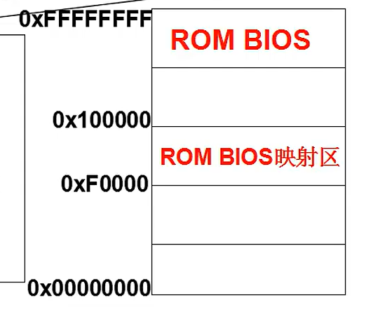

#引导山区代码：bootsects\.s

* int  0x10  bios中断
>显示字符

描述：
x86计算机
1.开机的时候处于实模式，寻址：cs:ip  （cs左移4位，+ip）
2.开机的时候，cs=0xffff；ip=0x0000
3.寻址0xffff0(rom bios映射区)
4.检查硬件
5.将***磁盘***0磁道0扇区(引导扇区)读入0x7c00(内存)
一个扇区512字节
6.设置cs=0x07c0   ip=0x0000

 

#引导扇区

![[20230923205247.png]]
磁盘引导扇区：
一段汇编代码：
因为c语言需要编译，编译会出现一些未知问题。
汇编和机器码1对1
 

引导扇区第一步：将bios从0x7c00移动到90000，把地址空出来。
 
通过13号中断，移动到setup扇区4个扇区到90200
//setup：打印logo
后边是操作系统了。

******

简言之：x86计算机
1.开机的时候处于实模式，寻址：cs:ip  （cs左移4位，+ip）
2.开机的时候，cs=0xffff；ip=0x0000
3.寻址0xffff0(rom bios映射区)，执行bios
4.检查硬件(bios)
5.将***磁盘***0磁道0扇区(引导扇区)读入0x7c00(内存)  *bios的工作*
一个扇区512字节
6.设置cs=0x07c0   ip=0x0000，执行引导扇区。

* 硬盘中的扇区
* ![[20230923214948.png]]

关于引导扇区：(512字节)
引导扇区代码bootsect.s
第一步：
将0x07c0:0x0000(第一个扇区)的512个字节移动到0x9000:0x0000(将引导扇区向后移动)
跳转到
下一步，实际是下一步执行。
第二步:将setup(boot后边得扇区)读到内存中。 (引导扇区后边的setup)从磁盘中移动到内存(第一引导扇区的高地址)中。(四个扇区)
第三步:执行一个打印工作。
第四步读入system
第五步执行setup
